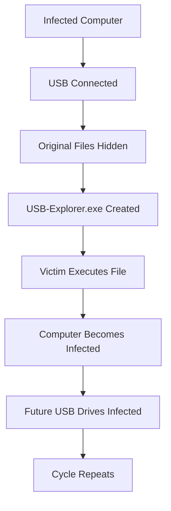
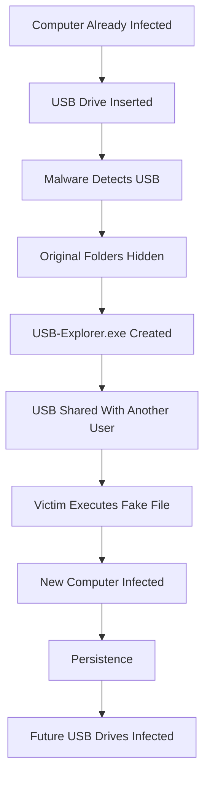
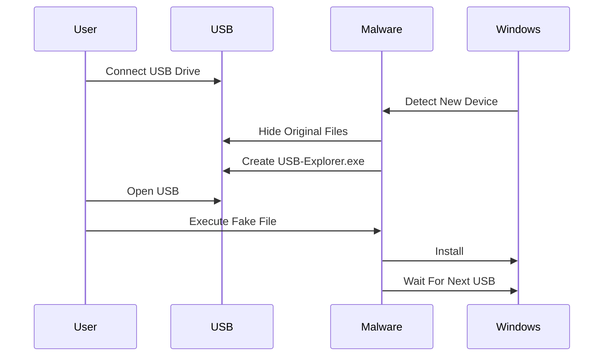
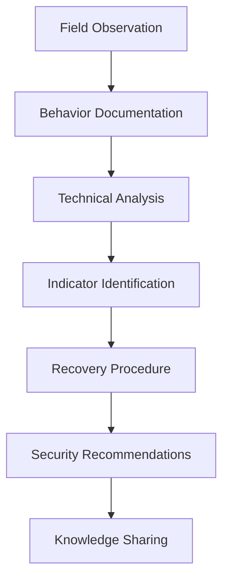

<!-- ========================================================= -->
<!--                      MAYUNDO USB WORM                     -->
<!-- ========================================================= -->

<div align="center">

# 🛡️ MAYUNDO USB Worm

### Technical Analysis • Malware Documentation • USB Security • Incident Response


</div>

---

# Overview

> [!IMPORTANT]
>
> **MAYUNDO** is a USB-propagated Windows malware commonly encountered in educational institutions, public computers, cyber cafés, and shared workstations.
>
> This repository provides a **defensive technical analysis** of the malware, documents its observed behavior, explains its infection workflow, and presents safe recovery procedures for affected users.
>
> The project is intended for **education, malware analysis, incident response, and cybersecurity awareness**.

---

# Why This Repository?

Very little public documentation exists regarding the MAYUNDO malware despite its widespread circulation in several regions.

This repository aims to provide a **centralized technical reference** for:

- 🎓 Students
- 🛡️ Cybersecurity researchers
- 💻 IT administrators
- 🔍 Digital forensic analysts
- 🚨 Incident responders

Unlike many online articles, this repository separates:

- ✅ Confirmed observations
- ⚠️ Investigation targets
- ❓ Unconfirmed behaviors

to maintain technical accuracy.

---

# Key Features

- 📖 Technical malware analysis
- 🦠 Complete infection workflow
- 🔍 Indicators of Compromise (IoCs)
- 🛠️ Step-by-step removal guide
- 🔒 Prevention recommendations
- ❓ Frequently Asked Questions
- 📚 References and documentation

---

# Repository Structure

```text
MAYUNDO-USB-Worm
│
├── README.md
│
├── docs
│   ├── 01-Introduction.md
│   ├── 02-Technical-Analysis.md
│   ├── 03-Infection-Workflow.md
│   ├── 04-Persistence.md
│   ├── 05-Indicators-of-Compromise.md
│   ├── 06-Removal-Guide.md
│   ├── 07-Prevention.md
│   ├── 08-FAQ.md
│   └── 09-References.md
│
├── images
│   ├── banner.png
│   ├── infection.png
│   ├── recovery.png
│   └── usb-explorer.png
│
├── LICENSE
└── SECURITY.md

```

---

# Documentation

| Document | Description |
|-----------|-------------|
| 📘 Introduction | Project overview |
| ⚙️ Technical Analysis | Internal malware behavior |
| 🔄 Infection Workflow | Complete attack chain |
| 📌 Persistence | Persistence mechanisms |
| 🔍 Indicators of Compromise | Detection artifacts |
| 🛠️ Removal Guide | Malware removal procedure |
| 🛡️ Prevention | Defensive recommendations |
| ❓ FAQ | Frequently asked questions |
| 📚 References | External resources |

---

# Malware Classification

| Property | Value |
|-----------|-------|
| Family | MAYUNDO |
| Type | USB Worm |
| Category | Trojan / Shortcut Virus |
| Platform | Microsoft Windows |
| Propagation | USB Removable Drives |
| Primary Goal | Propagation |
| Persistence | Observed |
| Encryption | Not Observed |

---

# Infection Overview



---

# Typical Infection

Before infection

```text
USB
│
├── Projects
├── Photos
├── Documents
└── Notes
```

↓

After infection

```text
USB
│
├── MAYUNDO
│   ├── Projects
│   ├── Photos
│   ├── Documents
│   └── Notes
│
└── USB-Explorer.exe
```

---

# Main Characteristics

| Feature | Status |
|----------|--------|
| Hides original folders | ✅ |
| Creates fake executable | ✅ |
| USB propagation | ✅ |
| Requires user interaction | ✅ |
| Persists after reboot | ⚠️ Observed |
| Encrypts files | ❌ |
| Deletes user files | ❌ Observed |

---

# Screenshots

> [!NOTE]
>
> Replace these placeholders with actual screenshots stored inside the `images/` directory.

| Infection | Hidden Files | Fake Executable |
|------------|--------------|-----------------|
|  |  |  |

---

# Quick Navigation

- 📘 Introduction
- ⚙️ Technical Analysis
- 🔄 Infection Workflow
- 📌 Persistence
- 🔍 Indicators of Compromise
- 🛠️ Removal Guide
- 🛡️ Prevention
- ❓ FAQ
- 📚 References

---

# Project Goals

This project aims to:

- Document the MAYUNDO malware.
- Improve cybersecurity awareness.
- Help victims recover their files.
- Encourage safe USB usage.
- Promote defensive security practices.
- Build a public technical reference for researchers.

---

# Disclaimer

> [!WARNING]
>
> This repository is intended **exclusively for educational, research, digital forensics, and defensive cybersecurity purposes**.
>
> It does **not** contain malware source code, offensive tooling, or instructions intended to facilitate cyberattacks.

---

➡️ **Continue to Part 2 of the README**, where we will add:
>
> - a professional Attack Lifecycle section;
> - a MITRE ATT&CK mapping (limited to confirmed observations where applicable);
> - detailed Mermaid diagrams;
> - incident response flow;
> - links to every document in `docs/`;
> - GitHub callout boxes;
> - a polished navigation experience.


---

# Attack Lifecycle

The MAYUNDO USB Worm follows a relatively simple but highly effective infection chain based on **social engineering** and **Windows file attribute manipulation**.

Unlike sophisticated malware that exploits software vulnerabilities, MAYUNDO primarily relies on convincing users to execute a malicious file that appears legitimate.

The complete lifecycle is illustrated below.



---

# Infection Timeline

```text
Infected Computer
        │
        ▼
USB Connected
        │
        ▼
Folders Become Hidden
        │
        ▼
Fake Executable Appears
        │
        ▼
Victim Executes Malware
        │
        ▼
Second Computer Infected
        │
        ▼
Propagation Continues
```

---

# Infection Stages

| Stage | Description |
|---------|-------------|
| Initial Infection | A Windows computer is already infected |
| USB Detection | Malware detects a removable drive |
| File Manipulation | Original folders become hidden |
| Payload Creation | Fake executable is created |
| User Interaction | Victim launches malicious executable |
| Installation | Malware copies itself onto the host |
| Persistence | Malware survives reboot (observed, mechanism under investigation) |
| Propagation | Every new USB becomes a potential carrier |

---

# Technical Highlights

| Feature | Observation |
|-----------|-------------|
| Infection Vector | USB Flash Drives |
| User Interaction Required | Yes |
| Privilege Escalation | Not Observed |
| File Encryption | Not Observed |
| Data Destruction | Not Observed |
| File Hiding | Confirmed |
| Social Engineering | Confirmed |
| USB Propagation | Confirmed |

---

# Infection Diagram



---

# What Makes MAYUNDO Effective?

The malware succeeds because it exploits **human expectations**.

Most users assume that:

- disappearing folders indicate data loss;
- USB-Explorer.exe is part of Windows;
- clicking the executable will restore access to their files.

Instead, this action executes the malware and allows it to spread.

---

# Defensive Opportunities

The attack chain can be interrupted at several points.

| Attack Stage | Defensive Action |
|---------------|------------------|
| Before USB insertion | Scan removable media |
| USB connected | Disable AutoPlay |
| Before execution | Display file extensions |
| After execution | Antivirus detection |
| Recovery | Restore hidden attributes |
| Post-cleanup | Verify persistence removal |

---

# Project Documentation

The repository is organized into dedicated technical documents.

| Document | Purpose |
|-----------|---------|
| 📘 01-Introduction | Project overview |
| ⚙️ 02-Technical-Analysis | Internal malware behavior |
| 🔄 03-Infection-Workflow | Complete infection lifecycle |
| 📌 04-Persistence | Windows persistence |
| 🔍 05-Indicators-of-Compromise | Detection artifacts |
| 🛠️ 06-Removal-Guide | Safe recovery |
| 🛡️ 07-Prevention | Security recommendations |
| ❓ 08-FAQ | Frequently Asked Questions |
| 📚 09-References | External resources |

---

# Repository Progress

| Component | Status |
|------------|--------|
| README | ✅ Complete |
| Documentation | ✅ Complete |
| Infection Workflow | ✅ Complete |
| Removal Guide | ✅ Complete |
| Prevention | ✅ Complete |
| FAQ | ✅ Complete |
| References | ✅ Complete |
| Reverse Engineering | 🚧 In Progress |
| IOC Expansion | 🚧 In Progress |
| MITRE ATT&CK Mapping | 🚧 In Progress |

---

# Current Research Status

> [!IMPORTANT]
>
> This project is an **active documentation effort**.
>
> Some technical aspects of MAYUNDO, particularly its persistence mechanisms and possible malware variants, remain under investigation.
>
> All confirmed observations are explicitly distinguished from assumptions or common malware techniques.

---

# Read the Full Documentation

For detailed technical information, continue with the documents available in the `docs/` directory.

Each document focuses on a single aspect of the malware to improve readability and facilitate future updates.

---

---

# 🚑 Quick Recovery Guide

> [!WARNING]
> If your USB drive suddenly appears empty and contains suspicious files such as **USB-Explorer.exe**, **do not execute them**.
>
> In most observed cases, your files are **hidden**, not deleted.

---

## Recovery Workflow


---

## Step 1 — Disconnect the USB Drive

Immediately disconnect the USB device.

Avoid:

- opening suspicious files;
- copying unknown executables;
- connecting the USB to additional computers.

---

## Step 2 — Clean the Host Computer

Run a **Full Scan** using an updated antivirus.

Recommended options include:

- Microsoft Defender
- Malwarebytes
- Bitdefender
- ESET
- Kaspersky

If malware is detected:

- quarantine it;
- remove detected threats;
- reboot the computer.

---

## Step 3 — Recover Hidden Files

Open **Command Prompt** as Administrator.

Navigate to the USB drive.

Example:

```cmd
E:
```

Run:

```cmd
attrib -h -r -s /s /d *.*
```

This restores the visibility of hidden folders.

---

## Step 4 — Remove the Malware

After the folders become visible:

Delete suspicious files such as:

```text
USB-Explorer.exe

USB-Explorer.lnk
```

Move legitimate folders back to the root of the USB drive if necessary.

---

## Step 5 — Verify

Reconnect the USB.

Check that:

- folders are visible;
- fake executables do not reappear;
- no new folders become hidden.

If reinfection occurs immediately, the computer is still infected.

---

# Common Indicators

The following artifacts strongly suggest MAYUNDO activity.

| Indicator | Confidence |
|------------|------------|
| USB-Explorer.exe | ⭐⭐⭐⭐⭐ |
| Hidden folders | ⭐⭐⭐⭐⭐ |
| Folder named MAYUNDO | ⭐⭐⭐⭐☆ |
| Automatic USB reinfection | ⭐⭐⭐⭐⭐ |

---

# Detection Checklist

```text
☐ USB-Explorer.exe exists

☐ Original folders disappeared

☐ Hidden/System attributes present

☐ USB infects other computers

☐ Computer infects clean USB drives

☐ Antivirus detects suspicious executable
```

---

# Documentation Map

```
README
│
├── 📘 Introduction
│
├── ⚙ Technical Analysis
│
├── 🔄 Infection Workflow
│
├── 📌 Persistence
│
├── 🔍 Indicators of Compromise
│
├── 🛠 Removal Guide
│
├── 🛡 Prevention
│
├── ❓ FAQ
│
└── 📚 References
```

---

# Recommended Reading Order

If you are...

### 🧑‍🎓 Student

Read:

1. Introduction

2. Removal Guide

3. Prevention

---

### 🛡 Incident Responder

Read:

1. IOC

2. Technical Analysis

3. Persistence

---

### 🔬 Malware Researcher

Read:

1. Technical Analysis

2. Infection Workflow

3. IOC

4. References

---

# Security Recommendations

Always:

✅ Scan removable drives.

✅ Display file extensions.

✅ Keep Windows updated.

✅ Keep Microsoft Defender enabled.

✅ Maintain backups.

Never:

❌ Execute unknown USB executables.

❌ Ignore antivirus alerts.

❌ Format the USB before attempting recovery.

❌ Assume hidden files are permanently lost.

---

# Frequently Asked Questions

### Does MAYUNDO encrypt files?

No confirmed evidence.

---

### Does MAYUNDO delete files?

Generally no.

Files are typically hidden.

---

### Can I recover my documents?

In most observed cases:

Yes.

---

### Should I format my USB?

No.

Attempt recovery first.

---

### Can MAYUNDO spread without Internet?

Yes.

USB drives are the primary propagation vector.

---

# Repository Statistics

| Documentation | Status |
|---------------|--------|
| Technical Documentation | ✅ |
| Recovery Guide | ✅ |
| IOC Documentation | ✅ |
| Prevention Guide | ✅ |
| FAQ | ✅ |
| References | ✅ |

---

# Contributing

Contributions are welcome.

You can help by:

- reporting new malware variants;
- submitting additional observations;
- improving documentation;
- correcting technical inaccuracies;
- translating documentation into other languages.

Please ensure all contributions remain focused on **defensive cybersecurity**.

---

---

# About This Project

## Mission

The goal of this project is to document and analyze the MAYUNDO USB Worm from a **defensive cybersecurity perspective**.

The project focuses on:

- malware awareness;
- digital hygiene;
- incident response education;
- file recovery;
- cybersecurity knowledge sharing.

The objective is not only to explain the malware, but also to help users understand how simple attack techniques can create large-scale impact when combined with human behavior.

---

# Why MAYUNDO Matters

USB malware remains a significant cybersecurity issue because removable devices are still widely used for:

- academic projects;
- document exchange;
- software transfer;
- offline environments;
- public computers.

In many educational environments, USB drives remain one of the most common ways files are exchanged.

This makes awareness and prevention essential.

---

# Research Approach

This repository follows a structured analysis methodology:



---

# Documentation Philosophy

Cybersecurity analysis requires accuracy.

Therefore, this project follows three principles:

## 1. Evidence First

Only observed behaviors are presented as confirmed facts.

---

## 2. Clear Separation

The documentation separates:

| Category | Meaning |
|----------|---------|
| Confirmed | Directly observed behavior |
| Suspected | Requires additional analysis |
| Unknown | No available evidence |

---

## 3. Defensive Purpose

All information is documented to improve:

- detection;
- prevention;
- response;
- cybersecurity education.

---

# Contributing

Contributions are welcome from:

- cybersecurity students;
- researchers;
- system administrators;
- malware analysts;
- technical writers.

---

## Ways To Contribute

You can contribute by:

### Documentation

- improving explanations;
- fixing errors;
- translating content;
- adding diagrams.

### Research

- documenting new MAYUNDO variants;
- sharing observations;
- improving detection methods.

### Security Analysis

- adding defensive detection ideas;
- improving incident response procedures.

---

# Contribution Guidelines

Before submitting changes:

1. Explain the purpose of your contribution.

2. Keep technical claims supported by evidence.

3. Avoid publishing malicious code.

4. Respect responsible disclosure practices.

5. Keep content focused on defensive cybersecurity.

---

# Responsible Disclosure

If you discover:

- a new MAYUNDO variant;
- a new behavior;
- a security issue related to this documentation;

please report it responsibly.

Do not publicly publish:

- personal information;
- infected user data;
- private organizational details.

---

# Ethical Statement

This repository exists to promote cybersecurity awareness.

It does not support:

- malware development;
- unauthorized access;
- data theft;
- malicious activity.

The information provided is intended for:

- education;
- research;
- defense;
- incident response.

---

# License

This project is released under the MIT License.

```
MIT License

Copyright (c) 2026 MAYUNDO USB Worm Research Project

Permission is hereby granted, free of charge, to any person obtaining a copy
of this software and associated documentation files, to deal in the Software
without restriction, including without limitation the rights to use, copy,
modify, merge, publish, distribute, sublicense, and/or sell copies.
```

---

# Acknowledgements

Special thanks to:

- cybersecurity communities sharing defensive knowledge;
- malware researchers documenting threats;
- open-source security projects;
- students and professionals contributing to awareness.

---

# Useful Resources

## Cybersecurity Frameworks

- MITRE ATT&CK  
  https://attack.mitre.org/

- NIST Cybersecurity Framework  
  https://www.nist.gov/cyberframework


## Security Tools

- Microsoft Sysinternals  
  https://learn.microsoft.com/sysinternals/

- Microsoft Defender  
  https://learn.microsoft.com/microsoft-365/security/


## Malware Research Platforms

- VirusTotal  
  https://www.virustotal.com/

- ANY.RUN  
  https://any.run/

---

# Project Status

```
MAYUNDO USB Worm Documentation

████████████████████ 100%

Documentation        ✅
Technical Analysis    ✅
Recovery Guide        ✅
Prevention Guide      ✅
FAQ                   ✅

Advanced Analysis     🚧
Additional IoCs       🚧
Variant Tracking      🚧
```

---

# Final Message

MAYUNDO demonstrates an important cybersecurity lesson:

> A simple attack combined with human trust can become a large-scale security problem.

Understanding how malware spreads is the first step toward building safer systems.

Through documentation, awareness, and responsible research, communities can reduce the impact of these threats.

---

<div align="center">

## ⭐ If this project helped you, consider supporting it by sharing it.

### Stay curious. Stay secure. 🛡️

</div>

---
