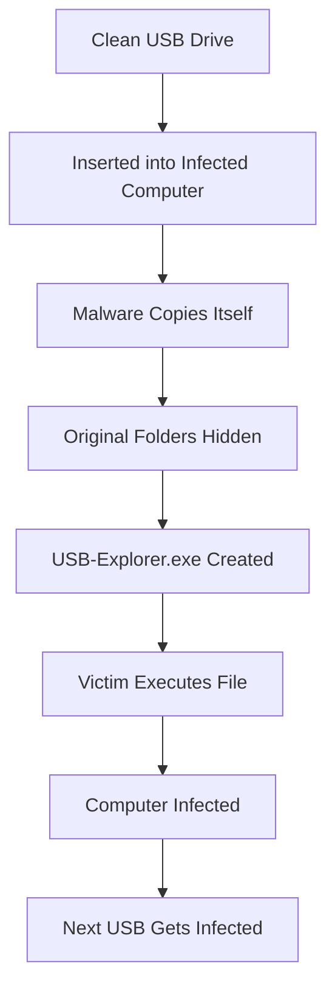
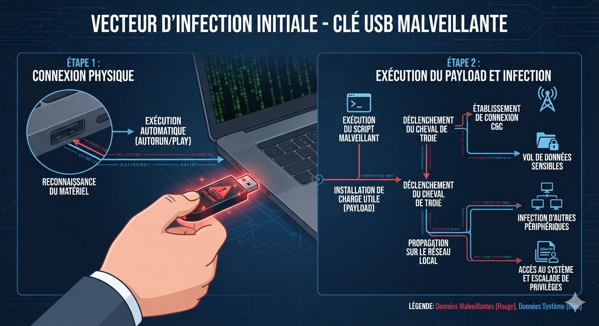
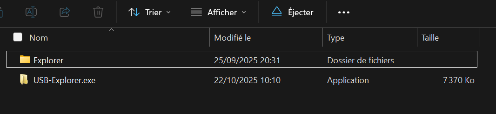

# MAYUNDO USB Worm

## Why this project?

The MAYUNDO USB Worm is one of the most widespread USB malware families observed across several universities and public computers in parts of Central, Eastern and Southern Africa.

Despite its prevalence, very little public technical documentation exists.

This repository aims to document its behavior and help users recover safely from an infection.

## Overview

The project explains:

- how it infects Windows

- how it spreads

- how to remove it

- how to recover hidden files

> [!WARNING]
> This repository is intended for **educational, research, and defensive cybersecurity purposes only**.
>
> It does **not** contain malware or malicious code.
>
> The objective is to understand the MAYUNDO USB Worm and learn how to detect, remove, and prevent infections.

## Infection Workflow

### Key Facts

| Property       | Value            |
| -------------- | ---------------- |
| Malware Name   | MAYUNDO          |
| Category       | USB Worm         |
| Target OS      | Windows          |
| Propagation    | USB Flash Drives |
| Language       | Unknown          |
| First Observed | Unknown          |
| Risk Level     | Medium           |

### Repository Structure
MAYUNDO-USB-Worm
│
├── README.md          # Documentation principale
├── docs               # Analyses détaillées
├── images             # Captures et diagrammes
├── LICENSE
└── SECURITY.md
## Screenshots

### Infected USB

### Fake Explorer

## Documentation

| Document           | Description                  |
| ------------------ | ---------------------------- |
| Technical Analysis | Fonctionnement interne       |
| Removal Guide      | Désinfection                 |
| IOC                | Indicateurs de compromission |
| FAQ                | Questions fréquentes         |

## Table of Contents

- Overview

- Infection Workflow

- Technical Analysis

- Indicators of Compromise

- Removal

- Recovery

- Prevention