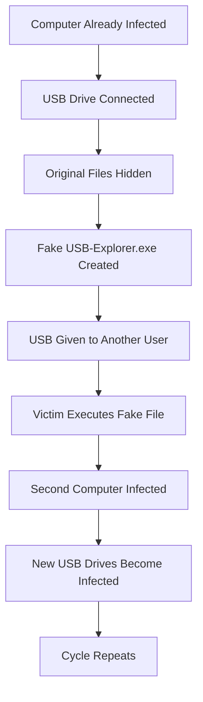

# Infection Workflow

> [!IMPORTANT]
> This document describes the complete infection lifecycle of the **MAYUNDO USB Worm**, from the initial infection of a Windows computer to the propagation of the malware across removable USB storage devices.
>
> The workflow presented here is based on observed behavior and standard malware analysis methodology.

---

# Table of Contents

- [Overview](#overview)
- [Attack Chain](#attack-chain)
- [Step 1 – Initial Infection](#step-1--initial-infection)
- [Step 2 – Malware Execution](#step-2--malware-execution)
- [Step 3 – Installation](#step-3--installation)
- [Step 4 – Persistence](#step-4--persistence)
- [Step 5 – USB Infection](#step-5--usb-infection)
- [Step 6 – Victim Interaction](#step-6--victim-interaction)
- [Step 7 – Propagation](#step-7--propagation)
- [Attack Chain Summary](#attack-chain-summary)

---

# Overview

The MAYUNDO malware spreads almost entirely through **USB flash drives**.

Unlike Internet worms that propagate through networks, this malware relies on **human interaction**.

The victim unknowingly becomes part of the propagation process by inserting infected USB drives into other computers.

---

# Global Infection Workflow



---

# Step 1 – Initial Infection

The infection starts when a Windows computer is already compromised.

Possible infection sources include:

- infected USB drives
- public computers
- Internet cafés
- shared laboratory computers
- previously infected classmates' devices

At this stage the user is generally unaware that the system has been infected.

---

# Step 2 – Malware Execution

The malware executes on the infected computer.

Typical actions include:

- loading into memory
- preparing the propagation routine
- monitoring removable drives

The malware waits silently until a USB device is connected.

---

# Step 3 – USB Device Detection

As soon as Windows mounts a removable drive, the malware begins processing it.

Typical workflow:

```text
USB Connected

↓

Drive Letter Assigned

↓

Malware Detects New Device

↓

USB Processing Begins
```

---

# Step 4 – Hiding Legitimate Files

Instead of deleting files, MAYUNDO attempts to hide them.

Typical operations include:

- moving folders into another directory
- applying the Hidden attribute
- applying the System attribute

The user now believes that the USB drive is empty.

Example:

Before infection:

```text
USB
│
├── TP
├── Projects
├── Notes
└── Photos
```

After infection:

```text
USB
│
├── MAYUNDO
│   ├── TP
│   ├── Projects
│   ├── Notes
│   └── Photos
│
└── USB-Explorer.exe
```

---

# Step 5 – Fake File Creation

The malware places one or more deceptive files at the root of the USB drive.

Examples:

```text
USB-Explorer.exe

USB-Explorer.lnk
```

These files often imitate:

- Windows Explorer
- folders
- removable drives

The objective is simple:

Convince the victim to click.

---

# Step 6 – Victim Interaction

This is the most important step.

The malware **requires user interaction**.

The victim:

1. opens the USB drive;
2. notices that folders have disappeared;
3. sees USB-Explorer.exe;
4. assumes it opens the USB;
5. executes the malware.

Without this step, propagation is significantly reduced.

---

# Step 7 – Installation on the New Computer

After execution:

the malware may:

- copy itself;
- configure persistence;
- prepare future propagation.

Possible directories include:

```text
%AppData%

%Temp%

%LocalAppData%
```

---

# Step 8 – Waiting State

The malware now remains idle.

It waits for:

- another USB drive;
- another victim.

No further user interaction is necessary.

---

# Step 9 – Propagation Continues

Every new USB device inserted into the infected machine becomes a potential carrier.

The entire cycle repeats automatically.


---

# Why Is MAYUNDO So Effective?

The malware succeeds because it exploits **human behavior** rather than sophisticated software vulnerabilities.

Users naturally expect to see their files.

When folders disappear, many assume that:

- Windows has malfunctioned;
- the USB drive is corrupted;
- USB-Explorer.exe is legitimate.

This misunderstanding leads to execution of the malicious file.

---

# Attack Chain Summary

| Phase | Description |
|---------|-------------|
|Initial Infection|Computer already compromised|
|Execution|Malware starts|
|USB Detection|New removable drive detected|
|Hide Files|Original folders hidden|
|Create Payload|USB-Explorer.exe created|
|Victim Clicks|Malicious executable launched|
|Installation|Malware copies itself|
|Persistence|Survives reboot|
|Propagation|Future USB drives infected|

---

# Defensive Opportunities

The attack chain can be interrupted at several points.

| Stage | Defensive Action |
|---------|-----------------|
|Before USB insertion|Use updated antivirus|
|After USB insertion|Scan the drive before opening|
|Before execution|Display file extensions|
|After infection|Clean the computer first|
|Recovery|Restore attributes using `attrib`|

---

# Key Takeaways

✔ The malware depends heavily on user interaction.

✔ It generally hides files rather than deleting them.

✔ USB drives act as the primary propagation vector.

✔ Cleaning the infected computer is essential before cleaning the USB drive.

✔ Understanding the infection workflow is the first step toward effective incident response.

---

# Next Document

➡ **[04-Persistence.md](04-Persistence.md)**

The next chapter explores how malware can remain active after reboot, including Windows Registry Run Keys, Startup folders, Scheduled Tasks, and other persistence techniques commonly used by USB worms.